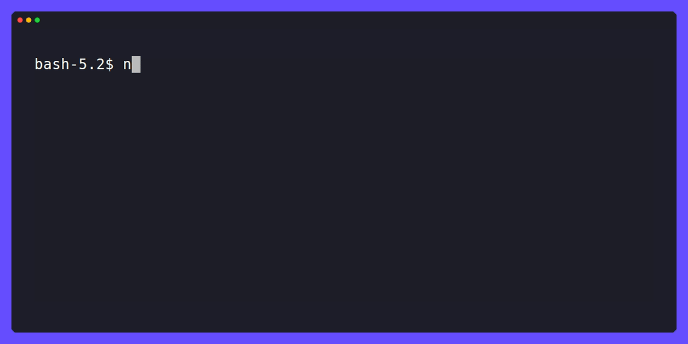

# llm-vcr

**Stop paying OpenAI to run your CI/CD tests.**

> Record LLM API calls once. Replay them instantly. Forever.


---

## The Problem

Your AI tests are slow, expensive, and flaky — because they hit the real API every time.

| | Without llm-vcr | With llm-vcr |
|--|--|--|
| Test duration | 8–15 seconds | < 50ms |
| Cost per CI run | $0.02–0.10 | $0.00 |
| Deterministic? | ✗ | ✓ |
| Works offline? | ✗ | ✓ |

## Installation

```bash
npm install llm-vcr --save-dev
```

## Quick Start

```typescript
// vitest.setup.ts (or jest.setup.ts)
import { setupLLMVCR } from 'llm-vcr';

setupLLMVCR({
  mode: process.env.CI ? 'replay' : 'record',
  cassetteDir: './__llm_cassettes__',
});
```

Add to `vitest.config.ts`:
```typescript
export default defineConfig({
  test: {
    setupFiles: ['./vitest.setup.ts'],
  },
});
```

That's it. Run your tests locally once to record cassettes, then commit
the `__llm_cassettes__` directory. CI replays them instantly.

## How It Works

```
First run (record mode)
  Your test → llm-vcr → OpenAI API
                   ↓
              saves cassette
              (__llm_cassettes__/a3f9b2c1.json)

Every run after (replay mode)
  Your test → llm-vcr → reads cassette → returns response
                   (never touches the network)
```

## Streaming (SSE) Support

llm-vcr handles Server-Sent Events streams natively.
Your streaming responses are recorded chunk-by-chunk and replayed instantly.

```typescript
// This works, even with streaming: true
const stream = await openai.chat.completions.create({
  model: 'gpt-4o',
  messages: [{ role: 'user', content: 'Hello' }],
  stream: true,
});

for await (const chunk of stream) {
  // Works perfectly in both record and replay mode
}
```

## Dynamic Prompts (Fuzzy Matching)

If your prompts include dynamic data (timestamps, user IDs), use `fuzzyMatch`:

```typescript
setupLLMVCR({
  mode: 'replay',
  fuzzyMatch: {
    ignore: ['messages[0].content.match(/Today is .+?\\./)', 'session_id'],
    onMiss: 'error', // default — never silently call the real API in CI
  },
});
```

## Security & Redaction

`Authorization` and `x-api-key` headers are **always** redacted from cassettes.
You will never accidentally commit an API key.

```typescript
setupLLMVCR({
  redact: {
    headers: ['Authorization', 'x-api-key', 'My-Custom-Token'],
    patterns: ['email', 'phone'],   // best-effort, not a compliance tool
    custom: (cassette) => {
      // Full control over cassette content before saving
      return cassette;
    },
  },
});
```

> ⚠️ **Note:** Pattern-based body redaction is a convenience feature, not a
> compliance framework. For GDPR/HIPAA-regulated data, use `custom` redactors
> and review cassettes before committing.

## Provider Support

Works out of the box with OpenAI and Anthropic.
Add community providers or build your own:

```typescript
import { setupLLMVCR, defineProvider } from 'llm-vcr';

const groqProvider = defineProvider({
  name: 'groq',
  baseUrls: ['https://api.groq.com'],
  hashFields: ['model', 'messages', 'temperature'],
});

setupLLMVCR({
  providers: [groqProvider],
});
```

## CLI Tools

```bash
# Analyze your cassette directory
npx llm-vcr doctor

# Compare two cassettes
npx llm-vcr diff cassettes/a3f9b2c1.json cassettes/b7d4e9f2.json
```

## All Options

```typescript
setupLLMVCR({
  mode: 'replay',           // 'record' | 'replay' | 'passthrough'
  cassetteDir: './__llm_cassettes__',
  streaming: {
    timing: 'instant',      // 'instant' (CI-safe) | 'faithful' (demo mode)
  },
  fuzzyMatch: {
    ignore: [],             // dot-notation field paths to exclude from hash
    onMiss: 'error',        // 'error' (safe default) | 'record'
  },
  redact: {
    headers: ['Authorization', 'x-api-key'],
    patterns: ['email'],    // 'email' | 'phone' | 'ssn'
    custom: undefined,
  },
  providers: [openaiProvider, anthropicProvider],
});
```

## License

MIT
